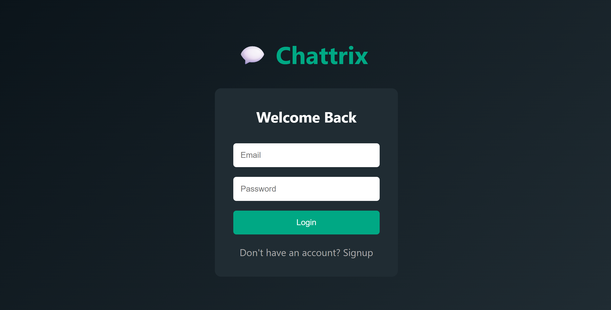
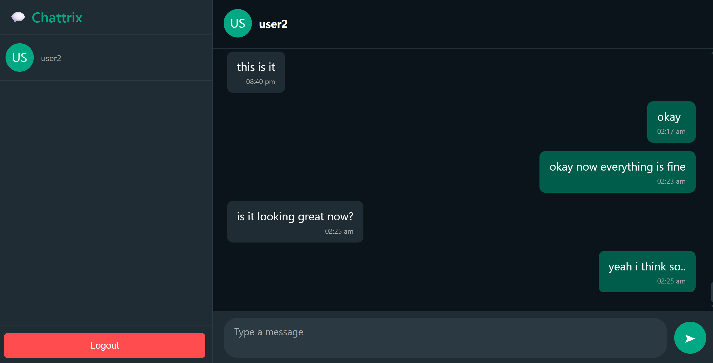

# 💬 Chattrix — Real-Time Chat Application

Chattrix is a full-stack real-time chat application built using **React, Node.js, Express, MongoDB, and Socket.IO**.
It supports instant messaging, authentication, typing indicators, and a modern WhatsApp-like UI.

---

## Features

*  User Authentication (Login & Signup)
*  Real-time messaging using Socket.IO
*  Online users indicator
*  Message timestamps
*  Chat history (stored in MongoDB)
*  Logout functionality

---

##  Tech Stack

### Frontend

* React.js
* Socket.IO Client
* Axios
* CSS (custom styling)

### Backend

* Node.js
* Express.js
* Socket.IO
* MongoDB (Mongoose)
* JWT Authentication

---

## 📁 Project Structure

```
chat-app/
│
├── client/        # React frontend
│   ├── src/
│   │   ├── components/
│   │   │   ├── Sidebar.js
│   │   │   ├── ChatWindow.js
│   │   │   ├── Login.js
│   │   ├── App.js
│   │   ├── App.css
│
├── server/        # Backend
│   ├── models/
│   ├── routes/
│   ├── server.js
│
├── package.json
```


##  Screenshots

### 🔐 Login Page


### 💬 Chat Interface


